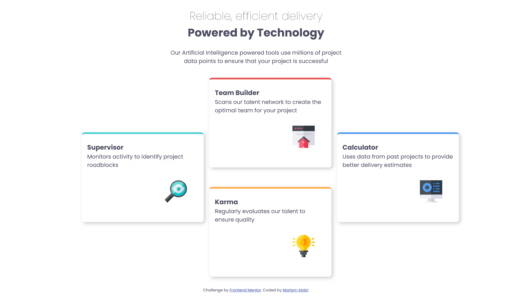
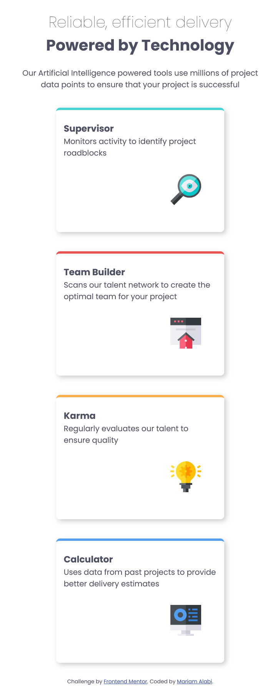

# Frontend Mentor - Four card feature section solution

This is a solution to the [Four card feature section challenge on Frontend Mentor](https://www.frontendmentor.io/challenges/four-card-feature-section-weK1eFYK). Frontend Mentor challenges help you improve your coding skills by building realistic projects.

## Table of contents

- [Overview](#overview)
  - [The challenge](#the-challenge)
  - [Screenshot](#screenshot)
  - [Links](#links)
  - [Built with](#built-with)
  - [What I learned](#what-i-learned)
- [Author](#author)
- [Acknowledgments](#acknowledgments)

## Overview

### The challenge

Users should be able to:

- View the optimal layout for the site depending on their device's screen size

### Screenshots




### Links

- Solution URL: (https://your-solution-url.com)
- Live Site URL: (https://mar-alabi.github.io/Four-card-feature-section/)

### Built with

- Semantic HTML5 markup
- CSS custom properties
- CSS Flexbox
- CSS Grid
- Mobile-first workflow

### What I learned

- I reiterated my practice on mobile-first design
- I also learnt about CSS grid, though it needs some more practice

```css
@media (min-width: 1280px) {
  .grid-container {
    display: grid;
    gap: 1rem;
    grid-template-columns: repeat(3, 350px);
    grid-template-rows: repeat(2, 1fr);
    align-items: center;
  }

  .cyan {
    grid-column: 1;
    grid-row: 1 / 3;
  }

  .red {
    grid-column: 2;
    grid-row: 1;
  }

  .orange {
    grid-column: 2;
    grid-row: 2;
  }

  .blue {
    grid-column: 3;
    grid-row: 1 / 3;
  }
}
```

## Author

- Website - [Add your name here](https://www.your-site.com)
- Frontend Mentor - [@yourusername](https://www.frontendmentor.io/profile/yourusername)
- Twitter - [@yourusername](https://www.twitter.com/yourusername)

**Note: Delete this note and add/remove/edit lines above based on what links you'd like to share.**

## Acknowledgments

This is where you can give a hat tip to anyone who helped you out on this project. Perhaps you worked in a team or got some inspiration from someone else's solution. This is the perfect place to give them some credit.

**Note: Delete this note and edit this section's content as necessary. If you completed this challenge by yourself, feel free to delete this section entirely.**
